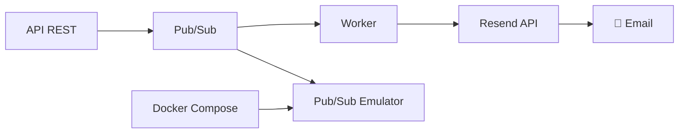

# 🚀 Go Integration - Worker de Email com Pub/Sub

Sistema de processamento assíncrono de emails usando Google Cloud Pub/Sub e Resend API.

## 📋 Como Rodar o Projeto Localmente

### 🔧 Pré-requisitos

- **Go 1.24+** instalado ([Download](https://golang.org/dl/))
- **Docker e Docker Compose** para o emulador Pub/Sub ([Download](https://docker.com/))
- **Conta Resend** com API Key ([Criar conta](https://resend.com/))

### ⚡ Setup Rápido (5 minutos)

1. **Clone o projeto:**
```bash
git clone <repository-url>
cd go_integration
```

2. **Configure o ambiente:**
```bash
# Copie o arquivo de exemplo
cp .env-example .env

# Edite com suas configurações
nano .env  # ou seu editor preferido
```

3. **Configure o `.env`:**
```bash
# Configurações do Projeto
PROJECT_ID=go-integration-local
PORT=8081

# API Key do Resend (obrigatório para envio real)
RESEND_API_KEY=re_SuaChaveAqui_AbC123XyZ

# Pub/Sub Local (não altere)
PUBSUB_EMULATOR_HOST=localhost:8432

# Tópicos e Subscriptions (pode manter)
EMAIL_TOPIC=send-email
EMAIL_SUBSCRIPTION=send-email-sub
VERIFICATION_TOPIC=email-verification
VERIFICATION_SUBSCRIPTION=email-verification-sub
USER_TOPIC=create-user
USER_SUBSCRIPTION=create-user-sub
```

4. **Instale dependências:**
```bash
go mod tidy
```

5. **Suba a infraestrutura:**
```bash
# Inicia o emulador Pub/Sub
docker-compose -f .infra/docker-compose.dev.yml up -d

# Verifica se está rodando
docker ps
```

6. **Execute o worker:**
```bash
# Terminal 1 - Worker de processamento
go run cmd/worker/main.go
```

7. **Execute a API (opcional):**
```bash
# Terminal 2 - API REST
go run cmd/api/main.go
```

✅ **Pronto!** O sistema está rodando em `http://localhost:8081`

## 🧪 Testando o Sistema

### 📧 Scripts de Teste Prontos

```bash
# Email regular
./examples/test_email.sh

# Email de boas-vindas  
./examples/test_welcome.sh

# Verificação com código
./test_verification_code.sh
```

### 🌐 Testando via API

#### 1. Email Regular
```bash
curl -X POST localhost:8081/api/email/send \
  -H "Content-Type: application/json" \
  -d '{
    "to": "seu-email@exemplo.com",
    "subject": "Teste de Email",
    "body": "Este é um teste do sistema."
  }'
```

#### 2. Verificação com Código
```bash
curl -X POST localhost:8081/api/verification/send \
  -H "Content-Type: application/json" \
  -d '{
    "to": "seu-email@exemplo.com",
    "username": "João",
    "code": "123456"
  }'
```

#### 3. Criação de Usuário (envia welcome automaticamente)
```bash
curl -X POST localhost:8081/api/user/create \
  -H "Content-Type: application/json" \
  -d '{
    "id": "user-123",
    "name": "João Silva", 
    "email": "joao@exemplo.com"
  }'
```

#### 4. Health Check
```bash
curl localhost:8081/health
```

## 🏗️ Arquitetura do Sistema



**Fluxo:**
1. **API** recebe requisição HTTP
2. **Publica** mensagem no Pub/Sub  
3. **Worker** processa mensagem
4. **Envia** email via Resend
5. **Logs** estruturados para monitoramento

## 📁 Estrutura de Arquivos

```
go_integration/
├── 🚀 cmd/
│   ├── api/main.go           # API REST (porta 8081)
│   └── worker/main.go        # Worker de emails
├── 🔧 internal/
│   ├── config/               # Configurações (.env)
│   ├── email/                # Templates e Resend API
│   ├── handlers/             # Lógica de processamento
│   ├── models/               # Structs de dados
│   └── pubsub/               # Cliente Pub/Sub
├── 🐳 .infra/
│   ├── docker-compose.dev.yml # Emulador local
│   ├── Dockerfile             # Build produção
│   └── deploy-cloudrun.sh     # Deploy GCP
├── 📝 examples/              # Scripts de teste
├── 🔑 .env                   # Configurações locais
└── 📚 README.md
```

## 🎨 Tipos de Email Suportados

### 1. 📩 Email Regular
- Template HTML responsivo
- Conteúdo personalizado
- Logo da empresa

### 2. 👋 Email de Boas-vindas  
- Disparado automaticamente na criação de usuário
- Template especial com nome personalizado
- Call-to-action para acessar conta

### 3. 🔐 Email de Verificação
- **Novidade:** Suporte a código de verificação visual
- Código destacado em box colorido
- Instruções claras de uso
- Expiração configurável

## 🔍 Logs e Monitoramento

O sistema usa **logs estruturados JSON** para facilitar monitoramento:

```json
{
  "time": "2025-09-22T16:30:17.943862-03:00",
  "level": "INFO", 
  "msg": "Processing verification email",
  "recipient": "user@example.com",
  "username": "João",
  "has_code": true,
  "type": "verification_email",
  "attempt": 1,
  "operation": "send_verification_email"
}
```

**Campos importantes:**
- `recipient`: Email de destino
- `type`: Tipo de email (regular, welcome, verification)
- `attempt`: Tentativa atual (retry automático)
- `operation`: Operação sendo executada

## ⚙️ Configurações Avançadas

### 🔧 Variáveis de Ambiente

| Variável | Descrição | Exemplo |
|----------|-----------|---------|
| `PROJECT_ID` | ID do projeto GCP | `go-integration-local` |
| `RESEND_API_KEY` | Chave da API Resend | `re_AbC123...` |
| `PUBSUB_EMULATOR_HOST` | Host do emulador | `localhost:8432` |
| `PORT` | Porta da API | `8081` |

### 🔄 Retry e Resiliência

- **3 tentativas** automáticas para cada email
- **Delay de 2 segundos** entre tentativas  
- **Logs detalhados** de cada tentativa
- **Graceful failure** - remove da fila após esgotar tentativas

### 📊 Health Check

```bash
curl localhost:8081/health
# {"status": "ok", "timestamp": "2025-09-22T19:30:17Z"}
```

## 🐛 Troubleshooting

### ❌ Problema: "connection refused" Pub/Sub

```bash
# Verificar containers
docker ps

# Reiniciar emulador
docker-compose -f .infra/docker-compose.dev.yml down
docker-compose -f .infra/docker-compose.dev.yml up -d
```

### ❌ Problema: Emails não chegam

1. **Verifique API Key:** Confirme `RESEND_API_KEY` no `.env`
2. **Modo teste:** Resend só envia para emails verificados na conta
3. **Check logs:** Procure por erros no terminal do worker

### ❌ Problema: Compilação falha

```bash
# Limpar cache e reinstalar
go clean -modcache
go mod download  
go mod tidy
```

### ❌ Problema: Worker não processa

1. **Check emulador:** `docker ps` deve mostrar pub/sub rodando
2. **Check variáveis:** `PUBSUB_EMULATOR_HOST=localhost:8432`
3. **Check logs:** Worker deve mostrar "Starting message processing"

## 🚀 Deploy para Produção

### Google Cloud Run

```bash
# Navegar para infra
cd .infra/

# Deploy automático
./deploy-cloudrun.sh
```

### Docker Local

```bash
# Build da imagem
docker build -t go-integration .

# Executar
docker run -p 8081:8081 --env-file .env go-integration
```

## 🔗 Links Úteis

- **Resend Dashboard:** [resend.com/dashboard](https://resend.com/dashboard)
- **Google Cloud Console:** [console.cloud.google.com](https://console.cloud.google.com)
- **Docker Desktop:** [docker.com/products/docker-desktop](https://docker.com/products/docker-desktop)

## 📚 Documentação Adicional

- 🏗️ **Arquitetura detalhada:** `ARQUITETURA.md`
- 🛠️ **Guia de desenvolvimento:** `DESENVOLVIMENTO.md`  
- 👥 **API de usuários:** `CREATE_USER_API.md`
- 🚀 **Deploy produção:** `DEPLOY.md`

---

## ⚡ TL;DR - Setup Ultra Rápido

```bash
# 1. Clone e configure
git clone <repo> && cd go_integration
cp .env-example .env
# Edite RESEND_API_KEY no .env

# 2. Suba tudo  
go mod tidy
docker-compose -f .infra/docker-compose.dev.yml up -d
go run cmd/worker/main.go &
go run cmd/api/main.go &

# 3. Teste
curl -X POST localhost:8081/api/email/send \
  -H "Content-Type: application/json" \
  -d '{"to":"seu-email@teste.com","subject":"Oi","body":"Funcionou!"}'
```

🎉 **Pronto para usar!**
